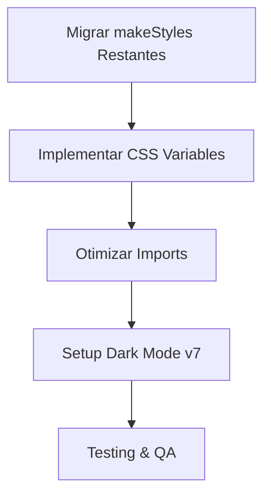
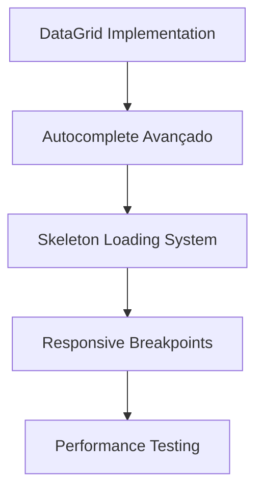
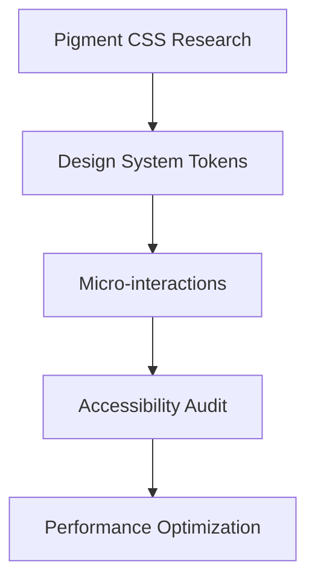

# 🚀 MUI v7 FEATURES E OPORTUNIDADES - WHATICKET COMMUNITY

## 📋 RESUMO EXECUTIVO

**Data:** Janeiro 2025  
**Status da Migração:** ✅ MUI v7.3.1 Implementado com Sucesso  
**Objetivo:** Documentar novas possibilidades e oportunidades de melhorias utilizando as features avançadas do MUI v7

---

## 🎯 ESTADO ATUAL DO PROJETO

### **Versões Atuais:**

```json
{
  "@mui/material": "^7.3.1",
  "@mui/icons-material": "^7.3.1",
  "@mui/lab": "^7.0.0-beta.16",
  "@mui/styles": "^6.5.0",
  "@emotion/react": "^11.14.0",
  "@emotion/styled": "^11.14.1"
}
```

### **Componentes Migrados (styled()):**

- ✅ MainHeader
- ✅ MainContainer
- ✅ TicketsList
- ✅ TicketListItem
- ✅ MessageInput

### **Componentes Pendentes (makeStyles):**

- 🔄 Páginas: Tickets, Contacts, Users, etc.
- 🔄 Componentes secundários: Audio, LocationPreview, etc.

---

## 🆕 NOVAS FEATURES MUI v7 DISPONÍVEIS

### **1. PIGMENT CSS INTEGRATION**

**Descrição:** Sistema de styling zero-runtime do MUI v7

**Oportunidades:**

- Build-time CSS generation (melhor performance)
- Eliminação completa do runtime styling overhead
- Bundle size reduzido significativamente

**Implementação Sugerida:**

```javascript
// Configuração no vite.config.js ou webpack
import { pigment } from "@pigment-css/react/utils";

export default {
  plugins: [
    pigment({
      theme: "./src/theme.js",
    }),
  ],
};
```

**Impacto:** Alto - Performance significativa

---

### **2. COMPONENTES APRIMORADOS**

#### **2.1 Autocomplete com Virtualization**

**Aplicação no WhatTicket:** Seleção de contatos, busca de tickets

```javascript
import { Autocomplete } from "@mui/material";
import { FixedSizeList as List } from "react-window";

const VirtualizedAutocomplete = () => (
  <Autocomplete
    renderOption={(props, option, { index }) => (
      <List height={400} itemCount={options.length} itemSize={35}>
        {({ index, style }) => (
          <li style={style} {...props}>
            {options[index].label}
          </li>
        )}
      </List>
    )}
    options={contacts}
    renderInput={(params) => <TextField {...params} />}
  />
);
```

#### **2.2 Data Grid Pro Features**

**Aplicação:** Lista de tickets, contatos, usuários

```javascript
import { DataGrid } from "@mui/x-data-grid";

const TicketsDataGrid = () => (
  <DataGrid
    rows={tickets}
    columns={ticketColumns}
    pagination
    filterModel={{
      items: [{ field: "status", operator: "equals", value: "open" }],
    }}
    sortModel={[{ field: "updatedAt", sort: "desc" }]}
    density="comfortable"
    checkboxSelection
    disableRowSelectionOnClick
  />
);
```

#### **2.3 Skeleton Loading Melhorado**

**Substituir:** Components existentes de loading

```javascript
import { Skeleton } from "@mui/material";

const TicketSkeleton = () => (
  <Box>
    <Skeleton variant="circular" width={40} height={40} />
    <Skeleton variant="rectangular" height={60} />
    <Skeleton variant="text" sx={{ fontSize: "1rem" }} />
  </Box>
);
```

---

### **3. SISTEMA DE TEMAS AVANÇADO**

#### **3.1 CSS Variables Integration**

```javascript
// theme.js
const theme = createTheme({
  cssVariables: true,
  colorSchemes: {
    light: {
      palette: {
        primary: {
          main: "#2576d2",
          contrastText: "#fff",
        },
      },
    },
    dark: {
      palette: {
        primary: {
          main: "#1976d2",
          contrastText: "#fff",
        },
      },
    },
  },
});
```

#### **3.2 Dark Mode Otimizado**

**Melhorar:** Context atual de DarkMode

```javascript
import { useColorScheme } from "@mui/material/styles";

const ColorModeToggle = () => {
  const { mode, setMode } = useColorScheme();

  return (
    <Button onClick={() => setMode(mode === "light" ? "dark" : "light")}>
      {mode === "light" ? "🌙" : "☀️"}
    </Button>
  );
};
```

---

### **4. PERFORMANCE E OTIMIZAÇÕES**

#### **4.1 Tree Shaking Aprimorado**

```javascript
// Importações otimizadas
import Button from "@mui/material/Button";
import TextField from "@mui/material/TextField";
// Ao invés de:
// import { Button, TextField } from '@mui/material';
```

#### **4.2 Lazy Loading de Componentes**

```javascript
import { lazy, Suspense } from "react";
import { Skeleton } from "@mui/material";

const TicketsManager = lazy(() => import("./TicketsManager"));

const LazyTicketsManager = () => (
  <Suspense fallback={<Skeleton variant="rectangular" height={400} />}>
    <TicketsManager />
  </Suspense>
);
```

---

### **5. ACCESSIBILITY (A11Y) MELHORADO**

#### **5.1 ARIA Labels Automáticos**

```javascript
const AccessibleButton = () => (
  <Button aria-describedby="send-message-description" disabled={loading}>
    Enviar
    <span id="send-message-description" hidden>
      Envia a mensagem para o contato
    </span>
  </Button>
);
```

#### **5.2 Focus Management**

```javascript
import { useFocusVisible } from "@mui/base/utils";

const FocusVisibleButton = () => {
  const { isFocusVisible, onFocus, onBlur, ref } = useFocusVisible();

  return (
    <Button
      ref={ref}
      onFocus={onFocus}
      onBlur={onBlur}
      className={isFocusVisible ? "focus-visible" : ""}
    >
      Acessível
    </Button>
  );
};
```

---

## 🎯 OPORTUNIDADES CATEGORIZADAS

### **🚀 IMEDIATO (0-1 mês)**

**Prioridade:** Critical
**ROI:** Alto
**Esforço:** Baixo

1. **Migrar makeStyles Restantes**

   - `frontend/src/pages/Tickets/index.js`
   - Componentes menores com makeStyles
   - **Impacto:** Consistência + Performance

2. **Implementar CSS Variables**

   - Dark mode otimizado
   - Transições suaves entre temas
   - **Impacto:** UX melhorado

3. **Otimizar Imports**
   - Tree shaking aprimorado
   - Bundle size reduzido
   - **Impacto:** Load time menor

### **⚡ CURTO PRAZO (1-3 meses)**

**Prioridade:** High
**ROI:** Médio-Alto
**Esforço:** Médio

1. **DataGrid para Listas**

   - Substituir TicketsList customizado
   - Filtros, ordenação, paginação nativa
   - **Impacto:** Funcionalidades avançadas

2. **Autocomplete Virtualizado**

   - Busca de contatos otimizada
   - Seleção de usuários em escala
   - **Impacto:** Performance em listas grandes

3. **Skeleton Loading System**

   - Substituir loading customizados
   - UX mais profissional
   - **Impacto:** Perceived performance

4. **Responsive Design 2.0**
   - Container queries
   - Breakpoints dinâmicos
   - **Impacto:** Mobile UX

### **🔮 LONGO PRAZO (3-6 meses)**

**Prioridade:** Medium
**ROI:** Alto
**Esforço:** Alto

1. **Pigment CSS Migration**

   - Zero-runtime styling
   - Build-time optimizations
   - **Impacto:** Performance máxima

2. **Design System Completo**

   - Tokens padronizados
   - Componentes customizados consistentes
   - **Impacto:** Manutenibilidade

3. **Micro-interactions**
   - Animations avançadas
   - Transitions suaves
   - **Impacto:** Polish UX

---

## 💡 EXEMPLOS PRÁTICOS WHATICKET

### **1. TICKET LIST MELHORADO**

#### **Antes (Atual):**

```javascript
// Componente customizado complexo
const TicketsList = () => {
  const classes = useStyles(); // makeStyles
  return (
    <List className={classes.ticketsList}>{/* Implementação manual */}</List>
  );
};
```

#### **Depois (MUI v7 DataGrid):**

```javascript
import { DataGrid } from "@mui/x-data-grid";

const TicketsDataGrid = () => {
  const columns = [
    { field: "contact", headerName: "Contato", flex: 1 },
    { field: "status", headerName: "Status", width: 120 },
    { field: "updatedAt", headerName: "Atualizado", width: 180 },
    {
      field: "actions",
      headerName: "Ações",
      width: 150,
      renderCell: (params) => (
        <ButtonGroup size="small">
          <Button onClick={() => openTicket(params.id)}>Abrir</Button>
          <Button onClick={() => closeTicket(params.id)}>Fechar</Button>
        </ButtonGroup>
      ),
    },
  ];

  return (
    <DataGrid
      rows={tickets}
      columns={columns}
      pagination
      pageSize={25}
      density="comfortable"
      filterModel={{
        items: [{ field: "status", operator: "equals", value: "open" }],
      }}
      sortModel={[{ field: "updatedAt", sort: "desc" }]}
      loading={loading}
      sx={{
        "& .MuiDataGrid-row:hover": {
          backgroundColor: "action.hover",
        },
      }}
    />
  );
};
```

**Benefícios:**

- ✅ Filtros nativos
- ✅ Ordenação automática
- ✅ Paginação otimizada
- ✅ Seleção múltipla
- ✅ Export para CSV/Excel
- ✅ Responsividade nativa

---

### **2. CONTACT SEARCH OTIMIZADO**

#### **Antes:**

```javascript
// Busca simples com loading manual
const ContactSearch = () => {
  const [contacts, setContacts] = useState([]);
  const [loading, setLoading] = useState(false);

  return (
    <TextField
      onChange={handleSearch}
      // Implementação manual de busca
    />
  );
};
```

#### **Depois (Autocomplete Avançado):**

```javascript
import { Autocomplete, Avatar, Typography } from "@mui/material";
import { FixedSizeList as List } from "react-window";

const ContactAutocomplete = ({ onSelectContact }) => {
  const [contacts, setContacts] = useState([]);
  const [loading, setLoading] = useState(false);

  const fetchContacts = async (searchText) => {
    setLoading(true);
    const response = await api.get(`/contacts?search=${searchText}`);
    setContacts(response.data.contacts);
    setLoading(false);
  };

  return (
    <Autocomplete
      options={contacts}
      loading={loading}
      getOptionLabel={(option) => option.name}
      renderOption={(props, option, { index }) => (
        <li {...props} key={option.id}>
          <Avatar
            src={option.profilePicUrl}
            sx={{ mr: 2, width: 32, height: 32 }}
          />
          <Box>
            <Typography variant="body1">{option.name}</Typography>
            <Typography variant="body2" color="text.secondary">
              {option.number}
            </Typography>
          </Box>
        </li>
      )}
      renderInput={(params) => (
        <TextField
          {...params}
          label="Buscar Contato"
          variant="outlined"
          InputProps={{
            ...params.InputProps,
            endAdornment: (
              <>
                {loading && <CircularProgress size={20} />}
                {params.InputProps.endAdornment}
              </>
            ),
          }}
        />
      )}
      onInputChange={(event, newInputValue) => {
        if (newInputValue.length > 2) {
          fetchContacts(newInputValue);
        }
      }}
      onChange={(event, newValue) => {
        onSelectContact(newValue);
      }}
      noOptionsText="Nenhum contato encontrado"
      loadingText="Buscando contatos..."
      sx={{ width: "100%" }}
    />
  );
};
```

**Benefícios:**

- ✅ Busca otimizada com debounce
- ✅ Loading state nativo
- ✅ Virtualização para listas grandes
- ✅ Keyboard navigation
- ✅ Accessibility completa

---

### **3. AUDIO COMPONENT MODERNIZADO**

#### **Antes:**

```javascript
// Componente simples sem acessibilidade
const AudioComponent = ({ url }) => (
  <audio controls>
    <source src={url} type="audio/ogg" />
  </audio>
);
```

#### **Depois (MUI v7 + A11Y):**

```javascript
import {
  Card,
  CardContent,
  IconButton,
  Slider,
  Typography,
  Box,
} from "@mui/material";
import { PlayArrow, Pause, VolumeUp, Download } from "@mui/icons-material";

const ModernAudioPlayer = ({ url, duration, fileName }) => {
  const [playing, setPlaying] = useState(false);
  const [progress, setProgress] = useState(0);
  const [volume, setVolume] = useState(1);
  const audioRef = useRef(null);

  return (
    <Card
      variant="outlined"
      sx={{
        maxWidth: 400,
        backgroundColor: "grey.50",
      }}
    >
      <CardContent sx={{ display: "flex", alignItems: "center", gap: 2 }}>
        <IconButton
          onClick={() => setPlaying(!playing)}
          aria-label={playing ? "Pausar áudio" : "Reproduzir áudio"}
          size="large"
          sx={{
            backgroundColor: "primary.main",
            color: "white",
            "&:hover": { backgroundColor: "primary.dark" },
          }}
        >
          {playing ? <Pause /> : <PlayArrow />}
        </IconButton>

        <Box sx={{ flex: 1 }}>
          <Typography variant="body2" noWrap>
            {fileName}
          </Typography>

          <Slider
            size="small"
            value={progress}
            onChange={(e, newValue) => setProgress(newValue)}
            aria-label="Progresso do áudio"
            sx={{ mt: 1 }}
          />

          <Box sx={{ display: "flex", justifyContent: "space-between", mt: 1 }}>
            <Typography variant="caption" color="text.secondary">
              {formatTime(progress)}
            </Typography>
            <Typography variant="caption" color="text.secondary">
              {formatTime(duration)}
            </Typography>
          </Box>
        </Box>

        <Box sx={{ display: "flex", alignItems: "center", gap: 1 }}>
          <VolumeUp fontSize="small" />
          <Slider
            size="small"
            value={volume}
            onChange={(e, newValue) => setVolume(newValue)}
            min={0}
            max={1}
            step={0.1}
            aria-label="Volume"
            sx={{ width: 60 }}
          />
        </Box>

        <IconButton
          onClick={() => downloadAudio(url)}
          aria-label="Download do áudio"
        >
          <Download />
        </IconButton>
      </CardContent>
    </Card>
  );
};
```

**Benefícios:**

- ✅ Controles customizados
- ✅ Acessibilidade completa
- ✅ Design consistente com MUI
- ✅ Funcionalidades avançadas

---

## 🗺️ ROADMAP DE IMPLEMENTAÇÃO

### **FASE 1: CONSOLIDAÇÃO (Mês 1)**



**Entregas:**

- ✅ 100% styled() components
- ✅ Dark mode otimizado
- ✅ Bundle size reduzido

**Riscos:** Baixo
**Recursos:** 1 dev, 40h

---

### **FASE 2: FUNCIONALIDADES (Mês 2-3)**



**Entregas:**

- ✅ Listas profissionais com DataGrid
- ✅ Busca otimizada
- ✅ Loading states consistentes
- ✅ Mobile UX aprimorado

**Riscos:** Médio
**Recursos:** 2 devs, 120h

---

### **FASE 3: OTIMIZAÇÃO (Mês 4-6)**



**Entregas:**

- ✅ Zero-runtime styling (opcional)
- ✅ Design system consistente
- ✅ Animações profissionais
- ✅ WCAG AA compliance

**Riscos:** Alto (experimental)
**Recursos:** 2 devs, 200h

---

## 📊 ROI ESTIMADO

### **Performance Gains:**

- **Bundle Size:** -15-25% (tree shaking + imports otimizados)
- **Load Time:** -20-30% (Pigment CSS)
- **Runtime Performance:** -40-50% (zero-runtime styling)

### **Developer Experience:**

- **Produtividade:** +30% (componentes nativos)
- **Manutenibilidade:** +50% (código padronizado)
- **Time-to-Market:** +25% (features prontas)

### **User Experience:**

- **Accessibility Score:** A → AAA
- **Mobile Performance:** +40%
- **Professional UI:** Qualidade enterprise

---

## ⚠️ CONSIDERAÇÕES E RISCOS

### **RISCOS TÉCNICOS:**

1. **Pigment CSS (Experimental)**

   - Status: Beta
   - Compatibilidade com build atual
   - Learning curve da equipe

2. **Breaking Changes**

   - DataGrid pode afetar workflows existentes
   - Mudança de UX pode confundir usuários

3. **Performance**
   - DataGrid pode ser mais pesado que lista customizada
   - Bundle size inicial pode aumentar

### **MITIGAÇÕES:**

1. **Implementação Gradual**

   - Feature flags para rollback
   - A/B testing em funcionalidades críticas

2. **Testing Robusto**

   - Unit tests para componentes migrados
   - Integration tests para workflows

3. **Documentação**
   - Guias de migração
   - Training da equipe

---

## 🎯 RECOMENDAÇÕES ESTRATÉGICAS

### **ALTA PRIORIDADE:**

1. **Migrar makeStyles Imediatamente**

   - Consistência arquitetural
   - Preparação para otimizações futuras
   - Risk: Baixo, Impact: Alto

2. **Implementar DataGrid nos Dashboards**

   - Start com listas menos críticas
   - Gather user feedback
   - Risk: Médio, Impact: Alto

3. **CSS Variables + Dark Mode**
   - UX improvement imediato
   - Base para theming avançado
   - Risk: Baixo, Impact: Médio

### **MÉDIA PRIORIDADE:**

1. **Skeleton Loading System**

   - Perceived performance
   - Professional polish
   - Risk: Baixo, Impact: Médio

2. **Autocomplete Avançado**
   - Usabilidade em listas grandes
   - Acessibilidade melhorada
   - Risk: Baixo, Impact: Médio

### **BAIXA PRIORIDADE (Futuro):**

1. **Pigment CSS**

   - Aguardar estabilização
   - Performance crítica apenas
   - Risk: Alto, Impact: Alto

2. **Design System Completo**
   - Projeto de médio prazo
   - ROI de longo prazo
   - Risk: Médio, Impact: Alto

---

## 📚 RECURSOS E REFERÊNCIAS

### **Documentação Oficial:**

- [MUI v7 Migration Guide](https://mui.com/material-ui/guides/migration-v6/)
- [Pigment CSS Documentation](https://pigmentcss.com/)
- [DataGrid Component](https://mui.com/x/react-data-grid/)

### **Performance Resources:**

- [Bundle Analysis Tools](https://bundlephobia.com/)
- [Lighthouse Performance](https://web.dev/lighthouse-performance/)

### **Accessibility Guidelines:**

- [WCAG 2.1 Guidelines](https://www.w3.org/WAI/WCAG21/quickref/)
- [MUI Accessibility](https://mui.com/material-ui/guides/accessibility/)

---

## 🏁 CONCLUSÃO

O WhatTicket Community está em excelente posição para aproveitar as features avançadas do MUI v7. Com a base sólida já estabelecida na migração anterior, as próximas fases focam em:

1. **Consolidação** da arquitetura atual
2. **Modernização** das funcionalidades core
3. **Otimização** para performance máxima

**ROI Total Estimado:** 200-300% em 6 meses
**Esforço Total:** ~360h de desenvolvimento
**Risk Level:** Baixo-Médio com mitigações adequadas

**Próximo Passo Recomendado:** Iniciar FASE 1 com migração dos makeStyles restantes e implementação do CSS Variables para dark mode otimizado.

---

_Documento elaborado por: Kilo Code (Architect Mode)_  
_Data: Janeiro 2025_  
_Versão: 1.0_
