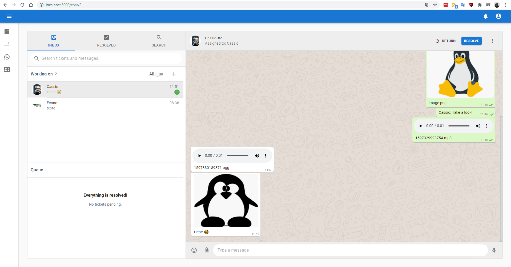
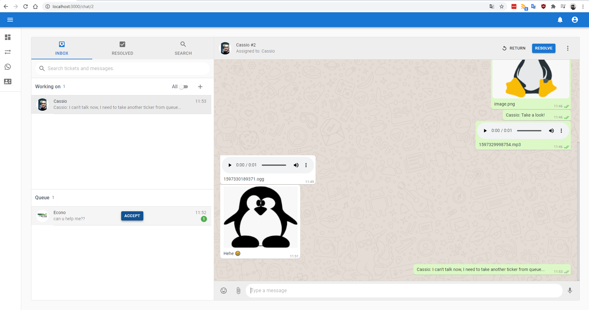
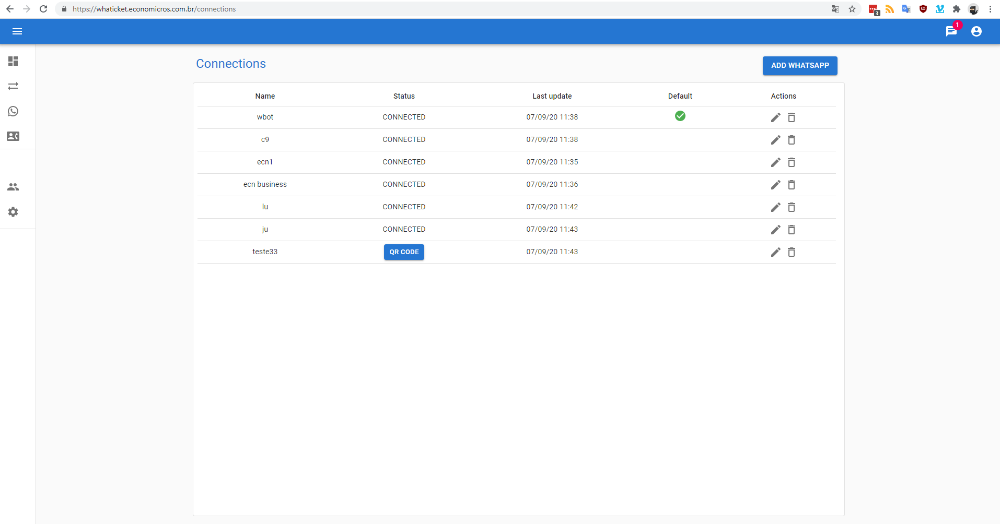
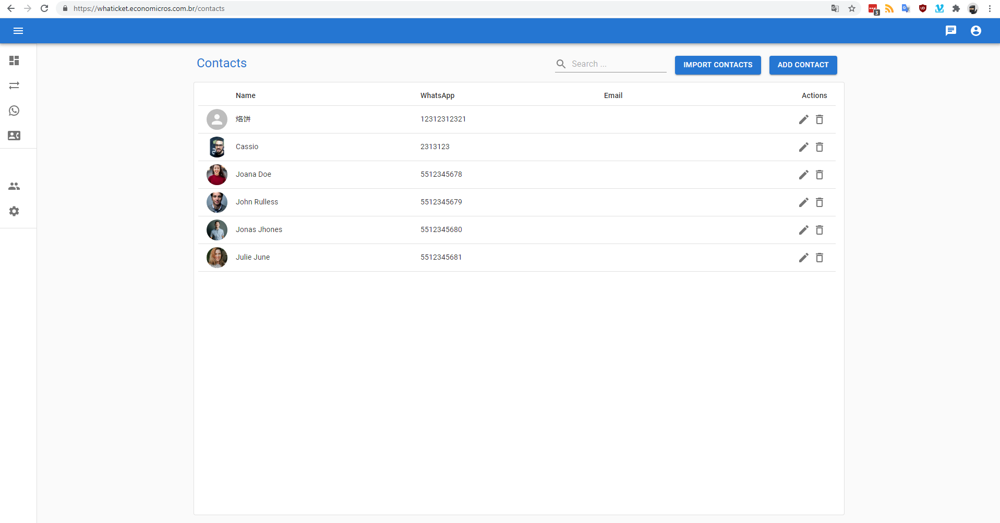

<p align="center">
  <a href="https://whaticket.com/?utm_source=github&utm_medium=readme&utm_campaign=whaticket-oss&utm_content=es-logo" target="_blank">
    <picture>
      <source media="(prefers-color-scheme: dark)" srcset="images/whaticket-logo-white.png">
      
    </picture>
  </a>
</p>

<h1 align="center">Whaticket Open Source</h1>

<p align="center">
  <strong>El sistema de tickets de WhatsApp, de código abierto, que dio origen a Whaticket.</strong><br>
  Varios agentes en un mismo número. Cada conversación se convierte en un ticket.
</p>

<p align="center">
  <a href="LICENSE"></a>
  <a href="https://github.com/canove/whaticket/stargazers"></a>
  <a href="https://discord.gg/Dp2tTZRYHg"></a>
  <a href="https://whaticket.com/?utm_source=github&utm_medium=readme&utm_campaign=whaticket-oss&utm_content=es-badge"></a>
</p>

<p align="center">
  <a href="README.md">English</a> · <a href="README.pt-br.md">Português</a> · <b>Español</b>
</p>

<p align="center">
  <a href="#qué-es-esto">Qué es esto</a> ·
  <a href="#open-source-vs-whaticket">Open Source vs Whaticket</a> ·
  <a href="#capturas-de-pantalla">Capturas de pantalla</a> ·
  <a href="#inicio-rápido-con-docker">Inicio rápido</a> ·
  <a href="#configuración">Configuración</a> ·
  <a href="#estado-del-proyecto">Estado del proyecto</a>
</p>

---

## Qué es esto

En 2020 este repositorio era un experimento de fin de semana: convertir mensajes de WhatsApp
en tickets de soporte para que todo un equipo pudiera responder desde un único número. Se
convirtió en uno de los proyectos de helpdesk para WhatsApp más forkeados de GitHub, y dio
origen a **[Whaticket](https://whaticket.com/?utm_source=github&utm_medium=readme&utm_campaign=whaticket-oss&utm_content=es-intro)**, la plataforma comercial que hoy
atiende a **más de 4.500 empresas** en América Latina.

Este repositorio es **Whaticket Open Source**: el código original, con licencia MIT. Puedes
alojarlo por tu cuenta, forkearlo y construir encima. El código del que nació la empresa sigue
siendo público.

**Backend**: Node.js + TypeScript + Express + Sequelize. Se comunica con WhatsApp a través
de una capa de proveedores intercambiable ([whatsapp-web.js](https://github.com/pedroslopez/whatsapp-web.js)
o [whaileys](https://github.com/canove/whaileys)) y guarda todo en MySQL/MariaDB.

**Frontend**: una aplicación de chat en React + Material UI, empaquetada con Vite. Habla con
el backend mediante REST y WebSockets, en español, portugués e inglés.

> [!NOTE]
> **¿Prefieres no administrar servidores?** [Whaticket](https://whaticket.com/?utm_source=github&utm_medium=readme&utm_campaign=whaticket-oss&utm_content=es-product-callout) es la
> plataforma gestionada creada por el mismo equipo. Trabaja con la API oficial de WhatsApp y
> reúne Instagram, Facebook, TikTok, Telegram y chat web en una sola bandeja de entrada, con
> chatbots con IA, campañas masivas y soporte 24/7.
> [14 días gratis, sin tarjeta de crédito](https://whaticket.com/precios/?utm_source=github&utm_medium=readme&utm_campaign=whaticket-oss&utm_content=es-trial).

## Open Source vs Whaticket

Ambos están hechos por el mismo equipo. La diferencia está en cuánta infraestructura quieres
administrar.

| | **Whaticket Open Source** | **[Whaticket](https://whaticket.com/?utm_source=github&utm_medium=readme&utm_campaign=whaticket-oss&utm_content=es-comparison-table)** |
|---|:---:|:---:|
| Licencia / precio | MIT, gratis para siempre | Desde US$ 49/mes para 3 usuarios |
| Alojamiento, actualizaciones, respaldos | Por tu cuenta | Gestionado |
| WhatsApp por código QR | ✅ | ✅ |
| API oficial de WhatsApp (Cloud API) | ❌ | ✅ |
| Varios agentes en el mismo número | ✅ | ✅ |
| Múltiples conexiones de WhatsApp | ✅ | ✅ |
| Colas / departamentos | ✅ | ✅ |
| Respuestas rápidas | ✅ | ✅ |
| Multimedia (imagen/audio/video/archivos) | ✅ | ✅ |
| Instagram, Facebook, TikTok, Telegram, chat web | ❌ | ✅ |
| Chatbots por reglas y con IA (Wäbot) | ❌ | ✅ |
| Campañas masivas | ❌ | ✅ |
| Reportes, CSAT y métricas de desempeño | Panel básico | ✅ |
| Integraciones (Zapier, Shopify, Slack, Google…) | ❌ | ✅ |
| Aplicaciones móviles (iOS / Android) | ❌ | ✅ |
| Soporte | Comunidad, en [Discord](https://discord.gg/Dp2tTZRYHg) y en los issues | 24/7 por WhatsApp |

El plan comercial empieza en 3 usuarios, lo que sale alrededor de US$ 16 por usuario al mes.

## Capturas de pantalla

<p align="center">
  
</p>

<table>
  <tr>
    <td width="50%"></td>
    <td width="50%"></td>
  </tr>
  <tr>
    <td align="center"><sub>Conversación de un ticket</sub></td>
    <td align="center"><sub>Vista del agente</sub></td>
  </tr>
  <tr>
    <td width="50%"></td>
    <td width="50%"></td>
  </tr>
  <tr>
    <td align="center"><sub>Múltiples conexiones de WhatsApp</sub></td>
    <td align="center"><sub>Gestión de contactos</sub></td>
  </tr>
</table>

## Funcionalidades

- 💬 **Bandeja de entrada compartida**: varios agentes respondiendo desde el mismo número
- 📱 **Múltiples conexiones**: conecta más de una cuenta de WhatsApp y recíbelo todo en un solo lugar
- 🎫 **Ciclo de vida del ticket**: pendiente → abierto → resuelto, con asignación por agente
- 🏷️ **Colas**: dirige las conversaciones entrantes al departamento correcto
- ⚡ **Respuestas rápidas**: mensajes predefinidos para las preguntas de todos los días
- 🖼️ **Multimedia**: envía y recibe imágenes, audios, videos y documentos
- 👥 **Contactos**: inicia conversaciones con contactos nuevos sin tocar el teléfono
- 📊 **Panel**: visión general de tickets y actividad de los agentes
- 🔌 **Proveedor de WhatsApp intercambiable**: `whatsapp-web.js` (Puppeteer) o `whaileys` (WebSocket)
- 🌍 **i18n**: español, portugués e inglés incluidos

### Cómo funcionan los tickets

Cada mensaje nuevo en un número de WhatsApp conectado crea un **Ticket**. Los tickets llegan a
una cola en la página *Tickets*, donde un agente **acepta** el ticket, lo responde y
finalmente lo **resuelve**.

Los mensajes posteriores del mismo contacto se adjuntan al primer ticket **abierto/pendiente**
que se encuentre. Si el contacto vuelve a escribir en menos de 2 horas y no tiene ningún
ticket pendiente ni abierto, se reabre el ticket **cerrado** más reciente en lugar de crear
uno nuevo.

## Requisitos

- **Node.js 14+** (la CI compila en Node 14)
- **MySQL 5.7+ o MariaDB 10.6+**
- **Docker** (opcional, pero es la forma más rápida de levantar la base de datos)
- **Redis** (opcional, se usa para persistir las claves de sesión de WhatsApp)
- Un servidor Linux si vas a producción. Estas instrucciones asumen Ubuntu 20.04+.

> [!WARNING]
> Los proveedores por código QR que se usan aquí son clientes **no oficiales** de WhatsApp.
> WhatsApp no permite bots ni clientes no oficiales en su plataforma, y los números conectados
> así pueden ser bloqueados. La alternativa soportada es la API oficial de WhatsApp, que
> [Whaticket](https://whaticket.com/?utm_source=github&utm_medium=readme&utm_campaign=whaticket-oss&utm_content=es-ban-warning) ofrece.

## Inicio rápido con Docker

```bash
git clone https://github.com/canove/whaticket.git
cd whaticket
cp .env.example .env
```

Edita el `.env`. Como mínimo, define `MYSQL_ROOT_PASSWORD`, `JWT_SECRET` y `JWT_REFRESH_SECRET`:

```bash
# MYSQL
MYSQL_ENGINE=mariadb
MYSQL_VERSION=10.6
MYSQL_ROOT_PASSWORD=cambia-esto
MYSQL_DATABASE=whaticket
MYSQL_PORT=3306
TZ=America/Fortaleza

# BACKEND
BACKEND_PORT=8080
BACKEND_SERVER_NAME=api.midominio.com
BACKEND_URL=https://api.midominio.com
PROXY_PORT=443
JWT_SECRET=cambia-esto
JWT_REFRESH_SECRET=cambia-esto-tambien

# FRONTEND
FRONTEND_PORT=80
FRONTEND_SSL_PORT=443
FRONTEND_SERVER_NAME=app.midominio.com
FRONTEND_URL=https://app.midominio.com
```

Levanta todo:

```bash
docker-compose up -d --build
```

**Solo en la primera ejecución**, carga los datos iniciales:

```bash
docker-compose exec backend npx sequelize db:seed:all
```

Abre el frontend, inicia sesión con la cuenta creada por el seed, ve a **Conexiones**, crea tu
primera conexión de WhatsApp y escanea el código QR. A partir de ahí, cada mensaje que reciba
ese número aparece en la lista de tickets.

**Credenciales por defecto:** `admin@whaticket.com` / `admin`. Cámbialas de inmediato.

<details>
<summary><b>Servicios Docker opcionales</b></summary>

phpMyAdmin, para inspeccionar la base de datos (puerto `9000` por defecto, configurable con
`PMA_PORT`):

```bash
docker-compose -f docker-compose.phpmyadmin.yaml up -d
```

Browserless, para ejecutar Chrome fuera del contenedor del backend (define
`MAX_CONCURRENT_SESSIONS`):

```bash
docker-compose -f docker-compose.browserless.yaml up -d
```

</details>

<details>
<summary><b>Certificados SSL en el entorno Docker</b></summary>

Coloca tus certificados en `ssl/certs`, con una carpeta por servicio:

```
.
├── certs
│   ├── backend
│   │   ├── fullchain.pem
│   │   └── privkey.pem
│   └── frontend
│       ├── fullchain.pem
│       └── privkey.pem
└── www
```

El contenedor nginx del frontend ya está preparado para responder al desafío webroot de
certbot:

```bash
certbot certonly --cert-name backend  --webroot --webroot-path ./ssl/www/ -d api.midominio.com
certbot certonly --cert-name frontend --webroot --webroot-path ./ssl/www/ -d app.midominio.com
```

</details>

## Ejecutar en local para desarrollo

<details>
<summary><b>Paso a paso del entorno de desarrollo</b></summary>

**1. Levanta una base de datos**

```bash
docker run --name whaticketdb \
  -e MYSQL_ROOT_PASSWORD=strongpassword \
  -e MYSQL_DATABASE=whaticket \
  -e MYSQL_USER=whaticket \
  -e MYSQL_PASSWORD=whaticket \
  --restart always -p 3306:3306 -d mariadb:10.6 \
  --character-set-server=utf8mb4 --collation-server=utf8mb4_bin
```

**2. Instala las dependencias de sistema de Puppeteer** (solo necesarias para el proveedor
`wwebjs`):

```bash
sudo apt-get install -y libxshmfence-dev libgbm-dev wget unzip fontconfig locales gconf-service \
  libasound2 libatk1.0-0 libc6 libcairo2 libcups2 libdbus-1-3 libexpat1 libfontconfig1 libgcc1 \
  libgconf-2-4 libgdk-pixbuf2.0-0 libglib2.0-0 libgtk-3-0 libnspr4 libpango-1.0-0 \
  libpangocairo-1.0-0 libstdc++6 libx11-6 libx11-xcb1 libxcb1 libxcomposite1 libxcursor1 \
  libxdamage1 libxext6 libxfixes3 libxi6 libxrandr2 libxrender1 libxss1 libxtst6 ca-certificates \
  fonts-liberation libappindicator1 libnss3 lsb-release xdg-utils
```

**3. Backend**

```bash
cd backend
cp .env.example .env   # luego complétalo, ver Configuración más abajo
npm install
npm run build
npx sequelize db:migrate
npx sequelize db:seed:all
npm run dev            # o: npm start
```

**4. Frontend**, en una segunda terminal:

```bash
cd frontend
cp .env.example .env
npm install
npm run dev
```

El `frontend/.env` solo necesita apuntar al backend:

```bash
VITE_BACKEND_URL = http://localhost:8080/
```

**5.** Abre <http://localhost:3000/signup>, crea un usuario, luego ve a **Conexiones** y
escanea el código QR.

</details>

## Despliegue en producción en un VPS

<details>
<summary><b>Ubuntu 20.04 + pm2 + nginx + Let's Encrypt</b></summary>

Estos pasos asumen que **no** estás como root, porque Puppeteer se niega a arrancar como root.
Apunta dos subdominios a tu servidor antes de empezar; esta guía usa `app.midominio.com` para
el frontend y `api.midominio.com` para el backend.

**Crea un usuario de despliegue**

```bash
adduser deploy
usermod -aG sudo deploy
su deploy
```

**Instala Node y Docker**

```bash
sudo apt update && sudo apt upgrade -y

curl -fsSL https://deb.nodesource.com/setup_14.x | sudo -E bash -
sudo apt-get install -y nodejs

sudo apt install -y apt-transport-https ca-certificates curl software-properties-common
curl -fsSL https://download.docker.com/linux/ubuntu/gpg | sudo apt-key add -
sudo add-apt-repository "deb [arch=amd64] https://download.docker.com/linux/ubuntu bionic stable"
sudo apt update && sudo apt install -y docker-ce
sudo usermod -aG docker ${USER}
su - ${USER}
```

**Base de datos, código y backend**

```bash
docker run --name whaticketdb \
  -e MYSQL_ROOT_PASSWORD=strongpassword -e MYSQL_DATABASE=whaticket \
  -e MYSQL_USER=whaticket -e MYSQL_PASSWORD=whaticket \
  --restart always -p 3306:3306 -d mariadb:10.6 \
  --character-set-server=utf8mb4 --collation-server=utf8mb4_bin

cd ~ && git clone https://github.com/canove/whaticket.git whaticket
cp whaticket/backend/.env.example whaticket/backend/.env
nano whaticket/backend/.env    # usa URLs https:// y PROXY_PORT=443

cd whaticket/backend
npm install
npm run build
npx sequelize db:migrate
npx sequelize db:seed:all
```

Confirma que arranca con `npm start` (deberías ver `Server started on port...`), detenlo con
`CTRL + C` y entrégalo a pm2:

```bash
sudo npm install -g pm2
pm2 start dist/server.js --name whaticket-backend
pm2 startup ubuntu -u $USER     # ejecuta el comando que imprima
```

**Frontend**

```bash
cd ../frontend
npm install
echo "VITE_BACKEND_URL = https://api.midominio.com/" > .env
npm run build
pm2 start server.js --name whaticket-frontend
pm2 save
```

**nginx**

```bash
sudo apt install -y nginx
sudo rm /etc/nginx/sites-enabled/default
sudo nano /etc/nginx/sites-available/whaticket-frontend
```

```nginx
server {
  server_name app.midominio.com;

  location / {
    proxy_pass http://127.0.0.1:3333;
    proxy_http_version 1.1;
    proxy_set_header Upgrade $http_upgrade;
    proxy_set_header Connection 'upgrade';
    proxy_set_header Host $host;
    proxy_set_header X-Real-IP $remote_addr;
    proxy_set_header X-Forwarded-Proto $scheme;
    proxy_set_header X-Forwarded-For $proxy_add_x_forwarded_for;
    proxy_cache_bypass $http_upgrade;
  }
}
```

Copia el archivo para el backend, cambiando `server_name` a `api.midominio.com` y `proxy_pass`
a `http://127.0.0.1:8080`, y habilita ambos:

```bash
sudo cp /etc/nginx/sites-available/whaticket-frontend /etc/nginx/sites-available/whaticket-backend
sudo nano /etc/nginx/sites-available/whaticket-backend
sudo ln -s /etc/nginx/sites-available/whaticket-frontend /etc/nginx/sites-enabled
sudo ln -s /etc/nginx/sites-available/whaticket-backend  /etc/nginx/sites-enabled
```

nginx limita el cuerpo de las peticiones a 1MB, insuficiente para subir multimedia. En
`/etc/nginx/nginx.conf`, dentro del bloque `http { }`:

```nginx
client_max_body_size 20M;
```

```bash
sudo nginx -t && sudo service nginx restart
```

**HTTPS**, obligatorio para notificaciones y envío de audio:

```bash
sudo snap install --classic certbot
sudo certbot --nginx
```

</details>

## Configuración

### Backend (`backend/.env`)

| Variable | Descripción | Por defecto |
|---|---|---|
| `WHATSAPP_PROVIDER` | Driver de WhatsApp: `wwebjs` o `whaileys` | `wwebjs` |
| `NODE_ENV` | `DEVELOPMENT` activa logs más detallados | |
| `PORT` | Puerto en el que escucha el backend | `8080` |
| `PROXY_PORT` | Puerto público detrás del reverse proxy (`443` en producción) | `8080` |
| `BACKEND_URL` | URL pública del backend | `http://localhost:8080` |
| `FRONTEND_URL` | URL pública del frontend. **El CORS depende de esto** | `http://localhost:3000` |
| `DB_HOST` / `DB_PORT` | Host y puerto de la base de datos | `localhost` / `3306` |
| `DB_DIALECT` | `mysql` | `mysql` |
| `DB_NAME` / `DB_USER` / `DB_PASS` | Credenciales de la base de datos | |
| `JWT_SECRET` / `JWT_REFRESH_SECRET` | Secretos de firma de los tokens, **cámbialos** | |
| `REDIS_URL` | Cadena de conexión de Redis. Vacío lo desactiva | |
| `REDIS_DB` | Índice de la base Redis para las claves de sesión | `0` |
| `CHROME_BIN` / `CHROME_WS` / `CHROME_ARGS` | Configuración de Puppeteer/Chrome (solo `wwebjs`) | |
| `LOG_LEVEL` | `silent`, `fatal`, `error`, `warn`, `info`, `debug`, `trace` | `info` |
| `WHAILEYS_LOG_LEVEL` | Nivel de log del proveedor `whaileys` | `error` |

### Frontend (`frontend/.env`)

| Variable | Descripción |
|---|---|
| `VITE_BACKEND_URL` | URL del backend con la que habla la aplicación |
| `VITE_HOURS_CLOSE_TICKETS_AUTO` | Horas de inactividad antes del cierre automático del ticket |

### Elegir un proveedor de WhatsApp

| | `wwebjs` | `whaileys` |
|---|---|---|
| Cómo conecta | Puppeteer controlando WhatsApp Web | Protocolo WebSocket directo |
| Consumo de memoria | Alto, un Chrome por sesión | Bajo |
| Dependencias de sistema | Chrome + varios paquetes `lib*` | Ninguna |
| Madurez en este repositorio | Por defecto, en producción durante años | Más nuevo, en desarrollo activo |

Cambia entre ellos con `WHATSAPP_PROVIDER` en `backend/.env`.

## Actualizar una instalación existente

Compara siempre el `.env.example` con tu `.env` antes de actualizar. Las variables nuevas
aparecen ahí primero.

```bash
#!/bin/bash
echo "Actualizando Whaticket, espera por favor."

cd ~/whaticket
git pull

cd backend
npm install
rm -rf dist
npm run build
npx sequelize db:migrate
npx sequelize db:seed

cd ../frontend
npm install
rm -rf build
npm run build

pm2 restart all
echo "Actualización finalizada. ¡Disfrútalo!"
```

## Estado del proyecto

**En modo mantenimiento, con el desarrollo activo de vuelta.**

Durante los últimos años este repositorio recibió solo parches de seguridad y actualizaciones
de dependencias, mientras el esfuerzo del equipo se dirigía a la plataforma comercial. Eso
está cambiando: planeamos retomar el trabajo regular de funcionalidades aquí. Los commits
recientes son los primeros pasos: el frontend migró a Vite, y la integración con WhatsApp pasó
a una capa intercambiable de proveedores, con el nuevo driver
[whaileys](https://github.com/canove/whaileys).

Qué significa esto para ti hoy:

- Los issues y pull requests se leen. Las revisiones pueden tardar.
- El código es estable y está ampliamente desplegado, pero espera asperezas y dependencias
  antiguas.
- Los cambios que rompan compatibilidad se señalarán en las notas de versión.

Si dependes de este proyecto, [cuéntanos en Discord](https://discord.gg/Dp2tTZRYHg) qué es lo
que más falta hace. Eso es lo que define las prioridades.

## Contribuir

Los pull requests son bienvenidos: correcciones de bugs, actualizaciones de dependencias,
documentación y traducciones. Para cualquier cosa grande, abre un issue antes para acordar el
enfoque.

- 💬 [Discord](https://discord.gg/Dp2tTZRYHg): preguntas y discusión
- 🐛 [Issues](https://github.com/canove/whaticket/issues): bugs y sugerencias

## Proyectos relacionados

- **[whaileys](https://github.com/canove/whaileys)**: la librería WebSocket de WhatsApp que
  usa el proveedor `whaileys`
- **[Whaticket](https://whaticket.com/?utm_source=github&utm_medium=readme&utm_campaign=whaticket-oss&utm_content=es-related-projects)**: la plataforma comercial gestionada

## Licencia

[MIT](LICENSE) © Whaticket y colaboradores.

## Aviso legal

Este proyecto no está afiliado, asociado, autorizado, respaldado ni conectado oficialmente de
ninguna forma con WhatsApp ni con ninguna de sus subsidiarias o filiales. El sitio oficial de
WhatsApp es <https://whatsapp.com>. "WhatsApp" y los nombres, marcas, emblemas e imágenes
relacionados son marcas registradas de sus respectivos dueños.

Usar clientes no oficiales para conectarse a WhatsApp puede provocar el bloqueo de tu número.
Usa este software bajo tu propio riesgo y revísalo según tus propios requisitos de seguridad
antes de exponerlo a internet.
