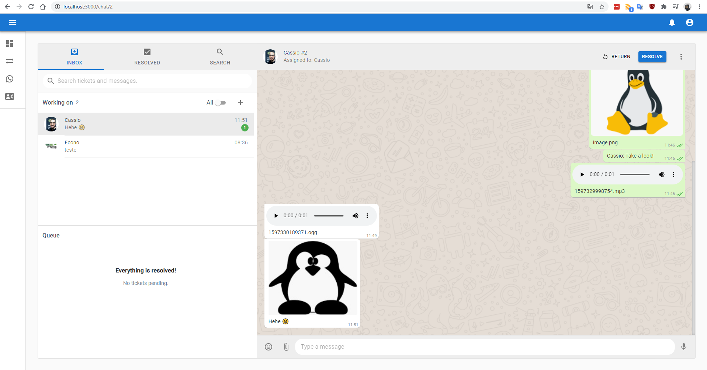
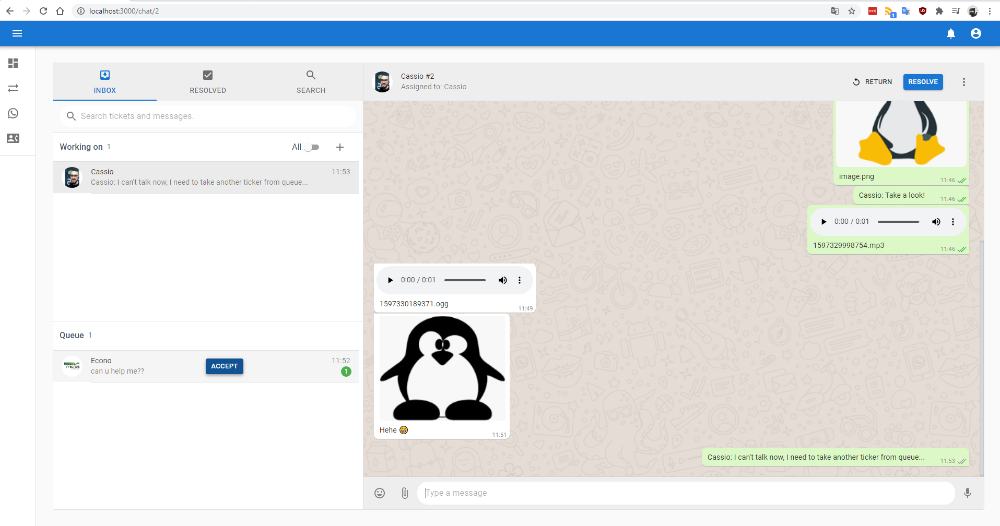

# WhaTicket

A _very simple_ Ticket System based on WhatsApp messages.

Backend uses [whatsapp-web.js](https://github.com/pedroslopez/whatsapp-web.js) to receive and send WhatsApp messages, create tickets from them and store all in a MySQL database.

Frontend is a full-featured multi-user _chat app_ bootstrapped with react-create-app and Material UI, that comunicates with backend using REST API and Websockets. It allows you to interact with contacts, tickets, send and receive WhatsApp messagees.

## Motivation

I'm a SysAdmin, and in my daily work, I do a lot of support through WhatsApp. Since WhatsApp Web doesn't allow multiple users, and 90% of our tickets comes from this channel, we created this to avoid the: 'Can I use Whatsapp now?' shoulder taps.

## How it works?

On every new message received in an associated WhatsApp, a new Ticket is created with **pending** status. Then, this ticket can be reached in frontend, where you can assign ticket to your yourself by _aceppting_ it (changing the status to **open**), respond ticket and eventually _resolve_ it (changing status to **closed**).

Subsequent messages from same contact will be related to first **open/pending** ticket found.

If a contact sent a new message in less than 2 hours, and there is no ticket from this contact with **pending/open** status, the newest **closed** ticket will be reopen, instead of creating a new one.

## Screenshots

 

## Installation and Usage (Linux Debian/Ubuntu)

Create Mysql Database using docker:
_Note_: change dbname, username password.

```bash
docker run --name whaticketdb -e MYSQL_ROOT_PASSWORD=strongpassword -e MYSQL_DATABASE=whaticket -e MYSQL_USER=whaticket -e MYSQL_PASSWORD=whaticket --restart always -p 3306:3306 -d mariadb:latest --character-set-server=utf8mb4 --collation-server=utf8mb4_bin
```

Install puppeteer dependencies:

```bash
sudo apt-get install -y libgbm-dev wget unzip fontconfig locales gconf-service libasound2 libatk1.0-0 libc6 libcairo2 libcups2 libdbus-1-3 libexpat1 libfontconfig1 libgcc1 libgconf-2-4 libgdk-pixbuf2.0-0 libglib2.0-0 libgtk-3-0 libnspr4 libpango-1.0-0 libpangocairo-1.0-0 libstdc++6 libx11-6 libx11-xcb1 libxcb1 libxcomposite1 libxcursor1 libxdamage1 libxext6 libxfixes3 libxi6 libxrandr2 libxrender1 libxss1 libxtst6 ca-certificates fonts-liberation libappindicator1 libnss3 lsb-release xdg-utils
```

- Clone this repo
- On backend folder:
  - Copy .env.example to .env and fill it with database details
  - Install dependecies: `npm install` (Only in the first time)
  - Create database tables: `npx sequelize db:migrate` (Only in the first time)
  - Start backend: `npm start`
- In another terminal, on frontend folder:
  - Copy .env.example to .env and fill it with backend URL (normally localhost:port)
  - Install dependecies: `npm install` (Only in the first time)
  - Start frontend: `npm start`
- Go to http://localhost:3000/signup
- Create an user and login with it.
- On the sidebard, go to _Connection_ and read QRCode with your WhatsApp.
- Go to _Tickets_.
- Done. Every message received by your synced WhatsApp number will appear in Tickets List.

## Features

Have multiple users chating in same WhatsApp Number ✅

Create and chat with new contacts without touching cellphone ✅

Send and receive message ✅

Send media (images/audio/documents) ✅

Receive media (images/audio/video/documents) ✅

## Contributing

Any help and suggestions are welcome!

## Disclaimer

I just started leaning Javascript a few months ago and this is my first project. It may have security issues and many bugs. I recommend using it only on local network.

This project is not affiliated, associated, authorized, endorsed by, or in any way officially connected with WhatsApp or any of its subsidiaries or its affiliates. The official WhatsApp website can be found at https://whatsapp.com. "WhatsApp" as well as related names, marks, emblems and images are registered trademarks of their respective owners.
